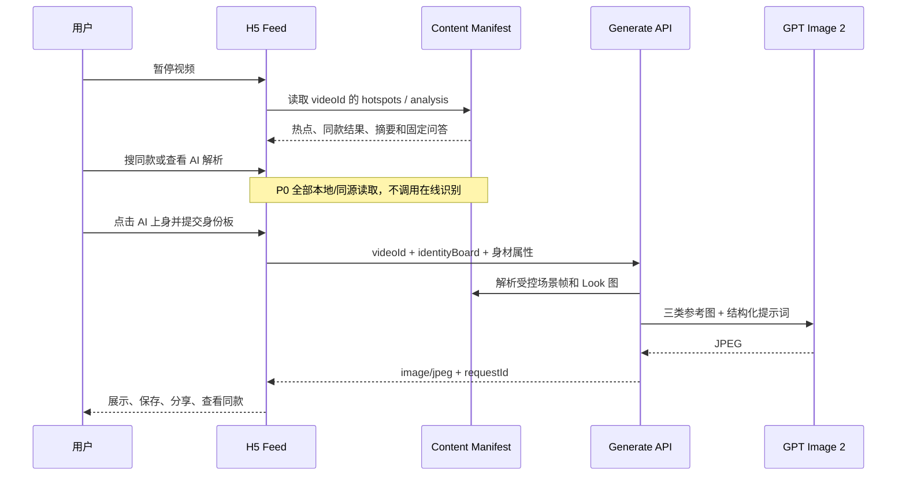

# 场景化穿搭创意 Demo 技术方案

> 版本：v1.3  
> 日期：2026-07-21  
> 目标周期：48 小时  
> 项目性质：现场可交互的创意 Demo  
> 方案依据：最新版 `PRD/PRD.md` 及其中三张交互原型图

## 1. 项目目标

实现一个以短视频内容为入口的场景化穿搭体验网站。评委可以在高度接近抖音的移动端 H5 Feed 中浏览预置视频，在暂停态识别服装单品、查看同款内容与商品、在评论区阅读 AI 解析，并从暂停态或 AI 解析页进入“AI 上身”。系统录入人物形象与基础身材信息后，真实调用 GPT Image 2，生成“用户本人 × 原视频场景 × 原视频完整 Look”的场景化穿搭图。

Demo 要证明的完整价值链路是：

```text
内容种草
  -> 暂停识物 / AI 解析帮助理解场景与穿搭
  -> 用户产生“换成我会怎样”的代入感
  -> AI 上身预览
  -> 保存/分享结果
  -> 查看同款商品
  -> 形成消费意愿
```

本阶段优先保证：

1. 入口像真实内容产品，而不是独立图片工具。
2. 场景、穿搭、人物三类参考输入职责明确。
3. 生图主链路真实可用且现场稳定。
4. 结果可以自然衔接保存、分享和商品浏览。

本阶段不承诺精确虚拟试衣、真实尺码推荐或任意视频自动理解。

## 2. PRD 到工程方案的关键映射

| PRD 需求或风险 | 48 小时 Demo 的工程决策 | 后续生产化方向 |
|---|---|---|
| 从大量 Feed 中识别场景化穿搭内容 | 预置视频人工审核，并在内容清单中标记 `eligible` | 离线视频抽帧、视觉分类、置信度路由与人工复核 |
| 暂停时识别视频中的服装 | 主展示视频预置归一化单品框、搜索文案和裁剪图；仅暂停时显示 | 服装检测、目标跟踪、OCR 去噪和热点碰撞布局 |
| 点击“搜同款”查看结果 | 本地 Manifest 直接映射综合内容卡与商品卡，不做实时检索 | 视觉向量检索、商品召回、排序与库存价格服务 |
| 评论区“AI 解析” | P0 使用预生成摘要、推荐问题和固定答案，AI 上身按钮复用统一流程 | 多模态内容理解、检索增强和受控多轮问答 |
| AI 上身入口 | 暂停态与 AI 解析页均调用 `startTryOn(videoId, entrySource)` | 后端按解析结果和实验策略动态下发入口配置 |
| 暂停帧可能模糊 | P0 不直接把任意暂停帧作为唯一生图依据，使用人工挑选的高清参考帧 | 自动清晰度、人脸完整度、服装完整度和场景质量打分 |
| 场景、人物、衣服三元素融合 | 分别准备场景全图、Look 细节图、人物三视角身份板 | 视频解析后自动产生场景与服装参考资产 |
| 用户要觉得“像我” | 正脸、左侧脸、右侧脸合成身份参考板，提示词明确身份优先级 | 加入全身参考、身体比例建模和一致性评估 |
| 从预览走向消费 | 结果页提供查看同款，商品数据与视频预先绑定 | 接入商品搜索、库存、价格与真实下单链路 |
| 生成图成为资产 | P0 支持下载、系统分享和当前会话收藏 | 用户账号、云端收藏、发布抖音作品 |

### 2.1 最新原型到系统能力的映射

| 原型界面 | 用户动作 | P0 数据来源 | 前端模块 | 生产化后端能力 |
|---|---|---|---|---|
| 暂停态识物热点 | 暂停视频，点击“搜同款帽子/衬衫/手套”等胶囊 | 人工标注的 `bbox`、裁剪图和查询词 | `HotspotOverlay` | 服装检测、目标跟踪、关键帧选择 |
| 同款搜索抽屉 | 查看目标框、裁剪图，在“综合/商品”间切换 | 预绑定的商品与相关内容 | `VisualSearchSheet` | 视觉检索、商品/内容召回与混排 |
| 评论区 AI 解析 | 切换“评论/AI 解析”，阅读摘要或点击推荐问题 | 预生成摘要、推荐问题和固定答案 | `AiAnalysisPanel` | 视频理解、RAG、内容安全与问答编排 |
| AI 上身 | 从暂停态或 AI 解析页进入生成流程 | 预选场景帧、Look 图和用户身份板 | `try-on/*` | 生成任务、存储、审核与资产管理 |

### 2.2 三层能力架构

```text
内容智能层
  视频资格、场景、Look、单品热点、同款映射、AI 摘要
       |
       v
互动 H5 层
  Feed、暂停识物、搜索抽屉、评论/AI 解析、AI 上身向导
       |
       v
生成与转化层
  人物采集、GPT Image 生成、结果资产、商品与收藏/分享
```

48 小时版本用 Content Manifest 模拟内容智能层的稳定输出；前端按同一数据契约消费。生产化时只替换内容来源，不重写交互主链路。

## 3. 范围定义

### 3.1 P0：48 小时内必须完成

1. 简短介绍页和“开始体验”入口。
2. 类似抖音的全屏竖向短视频 Feed，内置 3～6 个预置视频。
3. 视频播放、暂停、上下切换和当前视频状态管理。
4. 主展示视频在暂停后显示至少 3 个服装识物热点与“AI 上身”入口。
5. 点击识物热点打开同款搜索抽屉，支持“综合/商品”标签和预绑定结果。
6. 评论区支持“评论/AI 解析”切换；AI 解析展示摘要、推荐问题和“AI 上身”入口。
7. 为每个视频预置高清场景参考帧、Look 参考图、内容摘要和商品映射。
8. 选择 2～3 组预置人物，或通过摄像头采集正脸、左侧脸、右侧脸。
9. 选择男士/女士穿搭风格，填写身高并选择体重范围。
10. 确认场景、Look、人物和身体属性。
11. 通过 Next.js Route Handler 真实调用 GPT Image 2 Image Edits API。
12. 展示、下载、系统分享、当前会话收藏和重新生成结果。
13. 查看与当前 Look 绑定的静态同款商品详情。
14. 摄像头、生成、网络和内容审核失败时可以恢复。
15. 在目标 VPS 上通过域名和 HTTPS 对外提供访问。

为控制 48 小时风险，三张原型的完整交互优先在 1 条主展示视频上实现；其余视频可以只展示预配置入口和基础数据。该约束不影响架构契约，后续只需补充 Manifest 数据即可扩展。

### 3.2 P1：主链路完成后再做

1. 生成结果与参考图的滑动对比。
2. “真实自然”“时尚大片”等有限效果偏好。
3. 使用 IndexedDB 保存刷新后仍可访问的本地历史。
4. 运行时 AI 问答与流式回答；P0 只提供预生成内容。
5. 为预置视频展示多个可替换 Look。
6. 离线脚本辅助抽帧、计算清晰度并推荐候选帧。
7. 更完整的过渡动画、手势反馈和骨架屏。

### 3.3 本阶段明确不做

1. 用户上传任意视频。
2. 在线处理整段视频或实时识别任意 Feed 内容。
3. 在线自动识别场景、服装、商品和最佳帧。
4. 多人物主体选择、活体检测或身份验证。
5. 精确尺码、面料垂坠和合身度判断。
6. 真实商品库存、支付、订单或电商跳转。
7. 用户账号、云端数据库、管理后台和跨设备历史。
8. 真实发布到抖音账号。
9. 多轮聊天、局部改单品和视频生成。

当前方案是 PRD 的“可验证切片”。动态内容理解、真实交易与账号资产在 Demo 验证后扩展。

## 4. 核心业务链路

### 4.1 内容准备链路

P0 使用人工准备和结构化配置，避免现场依赖视频解析模型：

```text
选择预置视频
  -> 判断是否同时存在明确场景和完整 Look
  -> 选择高清场景参考帧
  -> 裁剪或准备 Look 细节参考图
  -> 标注交互帧单品框、标签偏移和搜索查询词
  -> 绑定商品卡片
  -> 绑定相关内容卡片
  -> 编写 AI 内容摘要、推荐问题和固定答案
  -> 填写场景标签与提示词补充信息
  -> 写入 Content Manifest
  -> Feed 读取并渲染识物、解析与 AI 上身入口
```

每个预置视频必须经过以下人工检查：

- 主体为单人或主要人物明确。
- 人物身体和服装主体没有被严重遮挡。
- 场景具有辨识度，不是纯色背景或弱场景棚拍。
- Look 相对完整，颜色、层次和主要配饰可见。
- 参考帧没有明显运动模糊、切镜或字幕遮挡。
- 热点框基于高清交互帧画布标注并归一化到 `0..1`，不得写死设备像素坐标。
- 同款结果与当前热点语义一致，商品和内容卡片都可追溯到具体 `hotspotId`。
- AI 摘要只描述画面可验证的信息，固定答案不得虚构品牌、价格或材质。
- 视频、人物、服装和商品素材具有演示使用授权。

#### 4.1.1 首版内容路由规则

| 内容类型 | P0 是否进入 AI 上身 | 判定理由 |
|---|---|---|
| 明确场景 + 单人完整 Look | 是 | 同时满足场景化判断与生成参考要求 |
| 商品广告/棚拍测评 | 否 | 缺少有效场景，留到 P1 场景推荐 |
| 多套 Lookbook | 条件进入 | 仅当人工选出单一完整 Look 和对应时间段 |
| 场合攻略/混剪 | 条件进入 | 仅当其中存在可独立使用的明确场景和完整 Look |
| 纯风景、多人遮挡、服装不完整 | 否 | 无法稳定构造三类生成输入 |

Manifest 中的 `eligible` 是这套规则的最终审核结果，不等同于模型的单次分类分数。

### 4.2 用户体验链路

```text
打开网站
  -> 查看三步介绍
  -> 进入抖音式 Feed
  -> 浏览并暂停符合条件的视频
  -> 点击单品热点查看同款商品/相关内容（探索支线）
  -> 打开评论区并切换到 AI 解析（理解支线）
  -> 从暂停态或 AI 解析页点击“AI 上身”（生成主线）
  -> 查看系统选定的场景和 Look 参考
  -> 选择预置人物，或拍摄正/左/右三视角
  -> 选择穿搭方向、身高和体重范围
  -> 确认所有输入并勾选图片处理授权
  -> 点击生成
  -> GPT Image 2 多图融合
  -> 展示结果
  -> 下载 / 分享 / 当前会话收藏 / 重新生成
  -> 查看同款商品
```

### 4.3 生图输入链路

为避免让模型自行猜测不同参考图的职责，按固定顺序组织三类图片：

```text
图片 1：场景全图
  决定背景、构图、氛围和大致姿势

图片 2：Look 细节参考
  决定服装颜色、版型、层次、纹理和配饰

图片 3：人物身份板
  包含正脸、左侧脸、右侧脸，决定身份与面部特征

结构化属性：身高 + 体重范围 + 男/女士穿搭方向
  只用于大致身体比例，不覆盖前述图片
```

人物三视角在浏览器 Canvas 中拼成一张身份板，减少输入图片数量，并让“这三张图属于同一个人”更明确。

## 5. 页面与交互设计

### 5.1 使用介绍页

只说明三步：

1. 浏览视频并发现“AI 上身”。
2. 选择或拍摄自己的形象。
3. 生成场景化穿搭并查看同款。

主操作为“开始体验”。不做复杂营销落地页。

### 5.2 抖音式短视频 Feed

- 使用全屏竖向滚动和 CSS `scroll-snap`。
- 当前视频进入主要视口后尝试播放，离开视口后立即暂停。
- 视频默认静音并设置 `playsInline`；首次用户交互后允许解除静音。
- 同时只挂载当前、前一条和后一条视频，降低移动端内存占用。
- 保留头像、点赞、评论、收藏、分享等视觉结构，但不实现无关业务。
- 显示视频标题、作者、场景标签和有限商品胶囊。
- 点击视频切换播放/暂停，并正确处理 `video.play()` 被浏览器拒绝的情况。

### 5.3 暂停态视觉搜索热点

- 视频播放时隐藏全部热点，暂停并满足 `visualSearch.enabled=true` 时显示。
- 为避免人物移动导致静态框错位，P0 进入识物态时用同视频的高清 `interactionFrameUrl` 覆盖暂停画面；恢复播放时撤下覆盖层并从原播放位置继续。
- 每个热点由单品框、引导线、文案胶囊和点击区域组成，数据来自 `OutfitHotspot`。
- 原型中的帽子、衬衫、手套等热点优先在 1 条主展示视频完整还原。
- 热点点击后记录 `videoId + hotspotId`，暂停视频并打开对应的同款搜索抽屉。
- 热点文案使用“搜同款{品类}”，不宣称识别到未经确认的品牌或精确款号。
- 多个胶囊重叠时优先使用 Manifest 中的 `labelOffset` 人工微调；P0 不实现自动布局算法。

### 5.4 同款搜索结果抽屉

抽屉覆盖视频下半区并保留上方目标区域，结构与原型一致：

1. 顶部展示当前热点目标框和裁剪缩略图。
2. 提供“综合/商品”两个标签。
3. “综合”混排 1 个主商品卡和 2～4 个相关穿搭内容卡。
4. “商品”只展示与当前 `hotspotId` 预绑定的商品。
5. 底部输入框 P0 只承载视觉表现与推荐词切换，不发起任意搜索。
6. 点击商品进入站内演示详情；点击内容卡切换到绑定的视频或展示静态预览。

搜索结果必须直接读取 Manifest，不在现场调用视觉检索或商品 API。这样既还原原型，也避免网络抖动和召回质量影响演示。

### 5.5 评论区与 AI 解析

评论按钮打开同一个底部抽屉，顶部提供“评论 / AI 解析”标签：

- “评论”展示少量静态评论，维持短视频产品的真实感。
- “AI 解析”展示内容摘要、安全提示、推荐问题胶囊和输入框视觉结构。
- 点击推荐问题直接展开 Manifest 中的固定答案；P0 不调用实时大模型问答。
- AI 解析页固定提供“AI 上身”主按钮，进入与暂停态相同的生成流程。
- 输入框在 P0 显示“更多提问功能即将开放”，不让用户误以为支持任意问答。

### 5.6 AI 上身双入口

#### 入口 A：暂停标签

当视频满足以下条件时，暂停后在人物或 Look 附近显示“AI 上身”胶囊：

```text
eligible = true
tryOn.enabled = true
tryOn.referenceFrameUrl 可读取
tryOn.outfitReferenceUrl 可读取
```

入口只表达“基于该场景与 Look 生成”，不承诺使用用户暂停的精确像素帧。

#### 入口 B：AI 解析页

评论按钮拉起底部抽屉，切换到“AI 解析”后显示固定卡片：

```text
✨ 想看看这套穿在你身上的效果？
[AI 上身]
```

暂停入口和 AI 解析页入口调用同一个 `startTryOn(videoId, entrySource)`，后续状态机完全复用，并记录入口来源用于演示分析。

### 5.7 场景和 Look 确认

进入生成流程后先展示：

- 场景参考全图。
- Look 细节图。
- 场景标签，例如旅行、森林、餐厅、酒吧、通勤。
- 与该 Look 绑定的商品数量。

用户可以返回换视频，但 P0 不允许修改系统选定的参考帧。

### 5.8 人物形象采集

提供两种模式：

- **预置人物**：选择已经准备好的 2～3 组人物身份板。
- **我的形象**：摄像头依次拍摄正脸、左侧脸和右侧脸。

摄像头流程要求：

- 必须由用户点击触发 `getUserMedia()`。
- 使用 `facingMode: "user"`。
- 每步展示方向提示、脸部轮廓和拍摄按钮。
- 支持单张重拍。
- 完成后立即停止所有媒体轨道，释放摄像头。
- 权限拒绝、无摄像头或非 HTTPS 时允许回到预置人物。
- P0 只做尺寸和空图校验，不做人脸识别或活体检测。

三张照片在浏览器中压缩并拼成一张身份板。预览可镜像，提交给模型的图片保持自然方向。

### 5.9 身材与穿搭属性

- 穿搭方向：`男士穿搭`、`女士穿搭`。
- 身高：140～210 cm。
- 体重范围：`50 kg 以下`、`50～60 kg`、`60～70 kg`、`70～85 kg`、`85 kg 以上`。
- 属性仅用于大致比例提示，不向用户承诺精确身材还原。
- 视频中的完整 Look 始终高于用户选择的文字标签。

### 5.10 生成确认

确认页同时展示：

- 场景参考图。
- Look 参考图。
- 人物身份板。
- 穿搭方向、身高和体重范围。
- 图片会通过第三方兼容网关发送至图像模型处理的明确说明。
- “我确认使用本人或已获授权的人像”的勾选项。

只有输入完整且授权已勾选时才允许提交。提交后锁定主按钮，避免重复请求。

### 5.11 等待与结果

- 等待页只展示阶段文案，不伪造百分比。
- 可使用“正在融合场景”“正在保留 Look 细节”“正在生成你的穿搭”等轮播提示。
- 结果页以生成图为主，保留场景和 Look 缩略图用于解释输入来源。
- 支持重新生成、更换人物和返回换视频。
- 支持下载 JPEG。
- 支持 `navigator.share()` 分享文件；不支持时回退到下载提示。
- 当前会话收藏只保存在 React 内存中；刷新即清空，界面要明确说明。

### 5.12 商品闭环

结果页提供“查看同款”主按钮，打开商品底部抽屉或站内静态详情页：

- 商品图。
- 商品名称。
- 演示价格。
- 与当前 Look 的对应关系。
- “其他场景穿搭”内容卡片。
- “演示商品，暂不支持真实购买”的清晰标记。

P0 不接支付和外部电商跳转，目标只是验证“预览结果是否能带动继续看商品”的链路。

## 6. 技术架构

### 6.1 技术选型

使用单一 Next.js 项目：

- 前端：Next.js App Router、React、TypeScript、CSS Modules。
- 后端：Next.js Route Handler，强制 Node.js Runtime。
- 状态：单页 `useReducer` 或轻量状态容器。
- 媒体：HTML Video、Canvas、MediaDevices、Web Share API。
- 生图：兼容 OpenAI 协议的 Node SDK，第三方网关 `https://api.8989886.xyz/v1`，`gpt-image-2` Image Edits API。
- 数据：P0 使用类型安全的 Content Manifest，承载热点、搜索、AI 解析和生成配置，不使用数据库。
- 部署：Docker Compose + Nginx，运行在 `47.95.225.76`。

采用 Next.js 的原因：前后端同仓库、同域部署，API Key 不进入浏览器，48 小时内最容易调试和部署。

### 6.2 系统结构

```text
移动端浏览器
  |
  | HTTPS
  v
Nginx :443
  |-- /               -> Next.js 页面
  |-- /media/*        -> 预置视频与参考图
  |-- /content/*      -> 构建期生成的内容清单与静态分析数据
  `-- /api/generate   -> Next.js Route Handler
                            |
                            | 第三方网关 API Key
                            v
                   兼容网关 -> GPT Image 2
```

浏览器不直接访问第三方网关。所有视频、参考图和站内接口保持同源，避免 Canvas、Cookie 和 CORS 问题。暂停识物、同款结果和 AI 解析在 P0 均为 Content Manifest 驱动，只有 AI 上身生成请求依赖外部模型服务。服务端必须显式配置 `baseURL`，禁止在第三方网关不可用时自动回落到 OpenAI 官方域名。

### 6.3 Content Manifest

P0 用代码配置承担“内容管理和路由结果”的职责：

```ts
type OutfitStyle = "menswear" | "womenswear";

interface NormalizedRect {
  x: number;      // 0..1，基于视频源画布左上角
  y: number;
  width: number;
  height: number;
}

interface ProductPreset {
  id: string;
  name: string;
  priceLabel: string;
  imageUrl: string;
  role: "top" | "bottom" | "dress" | "outerwear" | "shoes" | "accessory";
  demoOnly: true;
}

interface RelatedContentPreset {
  id: string;
  title: string;
  coverUrl: string;
  targetVideoId?: string;
}

interface OutfitHotspot {
  id: string;
  label: string;
  category: string;
  bbox: NormalizedRect;
  labelOffset: { x: number; y: number }; // 相对框中心的归一化微调
  cropUrl: string;
  searchQuery: string;
  productIds: string[];
  relatedContentIds: string[];
}

interface AiAnalysisPreset {
  summary: string;
  disclaimer: string;
  suggestedQuestions: Array<{
    id: string;
    question: string;
    answer: string;
  }>;
}

interface TryOnPreset {
  enabled: boolean;
  sceneSource: "video" | "recommended" | "user_upload";
  scenePrompt: string;
  referenceFrameUrl: string;
  outfitReferenceUrl: string;
  referenceTimestampMs: number;
  promptHint?: string;
}

interface VideoPreset {
  id: string;
  authorName: string;
  title: string;
  videoUrl: string;
  posterUrl: string;
  eligible: boolean;
  sceneLabel: string;
  outfitStyle: OutfitStyle;
  visualSearch: {
    enabled: boolean;
    interactionFrameUrl: string;
    interactionTimestampMs: number;
    sourceSize: { width: number; height: number };
    hotspots: OutfitHotspot[];
  };
  aiAnalysis: AiAnalysisPreset;
  tryOn: TryOnPreset;
  products: ProductPreset[];
  relatedContents: RelatedContentPreset[];
}

interface ContentManifest {
  schemaVersion: "1";
  contentVersion: string;
  updatedAt: string;
  videos: VideoPreset[];
}
```

Feed 只根据 Manifest 渲染入口，不在浏览器中执行视频识别。构建时必须执行 Schema 校验和资源完整性检查，至少保证：归一化框未越界、`hotspotId` 唯一、商品/内容外键存在、交互帧与生成参考图片可读取、`eligible` 与 `tryOn.enabled` 状态一致。

Manifest 可以先直接编译进前端包；视频数量增长后再改为 `GET /api/content/:videoId`。组件只依赖上述类型，不依赖数据究竟来自静态文件还是内容服务。

P0 只允许 `sceneSource="video"`。字段保留另外两种枚举，是为了与 PRD 的场景优先级对齐：P0 使用视频自带有效场景，P1 推荐与 Look 匹配的场景，P2 接受用户上传场景；后两种在本 Demo 不开放入口。

### 6.4 两条关键数据流



## 7. 前端模块与状态

### 7.1 目录建议

```text
app/
  page.tsx                         三步介绍
  experience/page.tsx              单页体验主流程
  api/generate/route.ts             生图 API
components/
  feed/VideoFeed.tsx                竖向视频列表
  feed/VideoFeedItem.tsx            单条视频与暂停入口
  feed/ActionRail.tsx               点赞/评论/收藏/分享视觉结构
  feed/HotspotOverlay.tsx           暂停态单品框、引导线和胶囊
  search/VisualSearchSheet.tsx      同款搜索抽屉
  search/SearchResultGrid.tsx       商品与相关内容混排
  comments/CommentSheet.tsx         评论/AI 解析容器
  comments/AiAnalysisPanel.tsx      摘要、问题与 AI 上身入口
  comments/SuggestedQuestions.tsx   固定问题和答案展开
  try-on/ReferenceReview.tsx        场景与 Look 确认
  try-on/IdentitySelector.tsx       预置/摄像头模式
  try-on/CameraCapture.tsx          三视角采集
  try-on/IdentityBoard.tsx          三图拼板
  try-on/BodyProfileForm.tsx        身高、体重和穿搭方向
  try-on/GenerationConfirm.tsx      生成前确认与授权
  try-on/GenerationProgress.tsx     等待状态
  try-on/GenerationResult.tsx       结果与操作
  product/ProductSheet.tsx          静态商品闭环
lib/
  content-manifest.ts               视频、参考图和商品配置
  geometry.ts                       object-fit: cover 坐标换算
  content-validation.ts             Manifest Schema 与外键校验
  image-client.ts                   压缩、拼板和 Blob URL
  image-generation.ts               第三方兼容网关服务端适配器
  prompt.ts                         提示词构造
  validation.ts                     请求校验
```

### 7.2 状态机

所有 Blob 保持在 `/experience` 单页中，不通过路由或 `sessionStorage` 传递：

```text
INTRO
  -> BROWSING
  -> PAUSED_WITH_HOTSPOTS
       -> VISUAL_SEARCH_OPEN -> BROWSING
       -> COMMENTS_OPEN -> AI_ANALYSIS_OPEN
  -> COMMENTS_OPEN -> AI_ANALYSIS_OPEN
  -> REFERENCE_REVIEW
  -> IDENTITY_SETUP
  -> PROFILE_SETUP
  -> READY_TO_GENERATE
  -> GENERATING
  -> SUCCEEDED | FAILED
  -> PRODUCT_VIEW
```

关键状态：

```ts
interface TryOnSession {
  videoId: string | null;
  entrySource: "pause_tag" | "ai_analysis" | null;
  identitySource: "preset" | "camera" | null;
  identityBoard: Blob | null;
  outfitStyle: OutfitStyle | null;
  heightCm: number | null;
  weightRange: "under_50" | "50_60" | "60_70" | "70_85" | "over_85" | null;
  consentAccepted: boolean;
  resultBlob: Blob | null;
  requestId: string | null;
}
```

页面离开或替换 Blob 时必须 `URL.revokeObjectURL()`，避免多次重拍和重新生成造成内存泄漏。

Feed 交互状态与生成会话分开管理，避免打开搜索抽屉时污染 AI 上身数据：

```ts
interface FeedInteractionState {
  activeVideoId: string | null;
  paused: boolean;
  resumeTimeMs: number | null;
  openSheet: "visual_search" | "comments" | null;
  commentTab: "comments" | "ai_analysis";
  selectedHotspotId: string | null;
  expandedQuestionId: string | null;
}
```

### 7.3 热点坐标换算

`bbox` 基于 `visualSearch.sourceSize` 归一化，而移动端交互帧通常用 `object-fit: cover` 显示，会产生水平或垂直裁切。覆盖层必须使用与交互帧相同的布局矩形，并计算：

```text
scale = max(containerWidth / sourceWidth, containerHeight / sourceHeight)
cropX = (sourceWidth  * scale - containerWidth)  / 2
cropY = (sourceHeight * scale - containerHeight) / 2

screenX = bbox.x * sourceWidth  * scale - cropX
screenY = bbox.y * sourceHeight * scale - cropY
screenW = bbox.width  * sourceWidth  * scale
screenH = bbox.height * sourceHeight * scale
```

在交互帧加载完成、容器 `ResizeObserver` 回调和屏幕旋转后重新计算。热点框超出可视区域时裁剪或隐藏，避免在不同手机上漂移到错误单品。生产化改为按时间戳下发检测/跟踪结果后，可以移除 P0 的固定交互帧覆盖策略。

## 8. 生图 API 设计

P0 的网络边界保持最小：

| 能力 | P0 实现 | 是否访问后端 |
|---|---|---|
| 视频、热点、搜索结果、AI 摘要 | 构建期 Manifest 与同源静态资源 | 首屏/按需静态读取，不调用 AI |
| 推荐问题回答 | Manifest 固定问答 | 否 |
| AI 上身 | `POST /api/generate` | 是，由服务端调用第三方兼容网关 |
| 任意搜索、任意问答 | 不开放 | 否 |

生产化后再增加 `GET /api/content/:videoId`、`POST /api/search/visual`、`POST /api/analysis/answer` 和异步生成任务接口。前端组件通过数据适配层消费，不能直接耦合这些未来接口。

### 8.1 前端请求

`POST /api/generate`

使用 `multipart/form-data`：

| 字段 | 类型 | 说明 |
|---|---|---|
| `videoId` | 字符串 | 从 Manifest 选择场景和 Look 资产 |
| `identityBoard` | JPEG/PNG/WebP 文件，可选 | 用户上传的人像；演示人物模式不提交文件 |
| `outfitStyle` | 字符串 | `menswear` 或 `womenswear` |
| `heightCm` | 数字 | 140～210 |
| `weightRange` | 字符串 | 预定义枚举 |
| `consentAccepted` | 布尔值 | 必须为 `true` |

场景参考图与 Look 参考图不由浏览器上传。服务端根据 `videoId` 从受控 Manifest 和本地文件中读取，避免客户端替换路径或提交任意服务器文件。

### 8.2 服务端处理

1. 校验请求体、枚举和授权状态。
2. 限制 `identityBoard` 为 JPEG/PNG/WebP，单文件不超过 4 MB。
3. 根据 `videoId` 查找 Manifest；不存在或 `eligible=false` 时拒绝。
4. 使用固定安全目录读取同时包含场景和完整 Look 的参考图，不接受客户端传入路径。
5. 使用服务端 `IMAGE_API_BASE_URL` 初始化兼容客户端，构造提示词并按固定顺序调用 `imageClient.images.edit()`。
6. 捕获网关请求 ID、耗时和错误码，但不记录用户图片。
7. 将兼容接口返回的 Base64 解码为 JPEG 二进制响应。

建议请求参数：

```ts
const imageClient = new OpenAI({
  apiKey: process.env.IMAGE_API_KEY,
  baseURL: process.env.IMAGE_API_BASE_URL,
});

await imageClient.images.edit({
  model: process.env.IMAGE_API_MODEL ?? "gpt-image-2",
  image: identityBoard ? [sceneAndLookReference, identityBoard] : [sceneAndLookReference],
  prompt,
  size: "512x768",
  quality: "low",
  output_format: "jpeg",
  output_compression: 85,
});
```

请求体沿用官方兼容格式：`gpt-image-2` 不传 `input_fidelity`，输入图使用多图数组。第三方网关是否完整支持全部参数需要单独联调；如果不支持 `output_format` 或多图数组，适配器负责降级参数或改用兼容的 multipart 请求，前端契约不变。

### 8.3 成功与失败响应

成功时直接返回二进制，避免 Data URL 的额外体积：

```http
HTTP/1.1 200 OK
Content-Type: image/jpeg
Cache-Control: no-store
X-Request-Id: req_xxx
```

失败时返回 JSON：

```json
{
  "success": false,
  "code": "GENERATION_FAILED",
  "message": "生成失败，请稍后重试",
  "requestId": "optional"
}
```

稳定错误码至少包括：

- `INVALID_INPUT`
- `VIDEO_NOT_ELIGIBLE`
- `CONSENT_REQUIRED`
- `REQUEST_IN_PROGRESS`
- `RATE_LIMITED`
- `MODERATION_BLOCKED`
- `UPSTREAM_TIMEOUT`
- `GENERATION_FAILED`

仅对 429、5xx 和网络错误进行有限重试；内容审核或输入错误不能原样自动重试。

## 9. 提示词策略

提示词必须明确图片顺序与优先级：

```text
Create one photorealistic vertical fashion image.

Reference roles:
- Image 1 is the authoritative reference for the background scene,
  overall composition, lighting, atmosphere, and approximate pose.
- Image 2 is the authoritative reference for the complete outfit,
  including colors, silhouette, layers, textures, and accessories.
- Image 3 is an identity board showing the same person from the front,
  left side, and right side. Preserve this person's recognizable facial identity.

Replace the original model in Image 1 with the person from Image 3.
Keep the scene from Image 1 and the complete outfit from Image 2.
Use the provided height and weight range only for natural approximate body proportions.
Show one adult person only. Keep anatomy natural.
Do not add text, logos, watermarks, extra garments, or unrelated accessories.
```

`scenePrompt` 和 `promptHint` 只能补充地点、氛围和特殊服装细节，不允许覆盖三类参考图的职责。

模型仍可能改变姿势、构图或人物细节。官方也明确提示复杂请求可能接近 2 分钟，且角色一致性和精确构图仍有限制：<https://developers.openai.com/api/docs/guides/image-generation#limitations>。因此必须提前用全部预置视频和人物组合做样例测试，而不是只验证 API 能返回图片。

## 10. 图片、性能与并发约束

- 场景参考帧最长边控制在 1536～2048 px。
- Look 细节图最长边约 1536 px。
- 身份板建议 1536 × 1024 或满足模型尺寸约束的相近比例。
- 摄像头单图最长边约 1024 px，JPEG 质量约 0.85。
- 身份板 JPEG 质量约 0.88。
- 前端同一时间只允许一个生成请求。
- 第三方网关客户端超时设为 95 秒并关闭 SDK 自动重试，Nginx 上游读取超时建议至少 110 秒。
- `client_max_body_size` 建议 12 MB；应用层仍单独校验文件大小。
- P0 默认使用 `quality: "low"` 和 JPEG 降低现场等待时间；网关稳定后再按场景切换到 `medium`。
- 不在 Next.js 日志中打印 multipart 内容、Base64 或图片 Buffer。
- 为每个预置视频准备一张明确标注的离线示例结果，只在演示讲解或上游完全不可用时人工启用。

## 11. 错误处理与现场兜底

| 异常 | 处理方式 |
|---|---|
| 视频无法播放 | 展示海报并允许切到下一条，不显示 AI 入口 |
| 视频不符合场景化穿搭 | 不显示 AI 入口 |
| 固定交互帧加载失败 | 保留原视频暂停画面并隐藏识物热点，AI 上身仍可用 |
| 热点数据缺失或越界 | 隐藏异常热点，其余 Feed 和 AI 上身仍可使用 |
| 同款结果为空 | 显示“暂未找到更多同款”，保留返回视频操作 |
| AI 解析数据缺失 | 回退到评论标签，不展示空白 AI 解析页 |
| 评论抽屉或暂停入口重复点击 | 复用当前会话，不重复创建流程 |
| 摄像头权限拒绝 | 提示授权方法，并允许选择预置人物 |
| 设备没有摄像头 | 隐藏拍摄模式，保留预置人物 |
| 身份板生成失败 | 保留原始三张预览，允许重试拼板 |
| 图片过大或格式错误 | 前端阻止提交，服务端再次校验 |
| 第三方图像网关 429 | 不自动重试，保留当前输入并显示重试按钮 |
| `moderation_blocked` | 显示通用安全提示，不自动原样重试 |
| API 超时 | 结束等待，保留全部输入，允许再次生成 |
| 第三方网关 5xx/超时 | 开启 `IMAGE_API_FALLBACK` 时返回明确标记的本地演示结果；不回落到 OpenAI 官方域名 |
| 分享 API 不支持 | 回退为下载文件 |
| 上游完全不可用 | 由演示人员人工启用已标注的示例结果 |

## 12. 隐私、安全与数据边界

- 拍摄前说明用途，提交前再次获得明确授权。
- 文案必须说明图片会通过第三方兼容网关发送至图像模型处理，并标明服务提供方。
- 应用自身不写数据库、不长期保存人脸图、不上传到其他存储。
- 不在日志、错误追踪或分析事件中记录图片内容。
- 关闭页面、刷新页面或替换人物后释放当前 Blob 和 Object URL。
- 摄像头拍摄完成或退出流程时立即停止媒体轨道。
- API Key 仅保存在服务器环境变量中，使用 `IMAGE_API_KEY`；网关地址使用 `IMAGE_API_BASE_URL`。
- 前端不得出现任何 `NEXT_PUBLIC_*` API Key。
- 管理和部署端口不暴露到公网，只开放 22、80、443。
- 生成接口加入基础 IP 限流和并发锁，避免演示链接被刷接口。

OpenAI 官方的数据政策不能直接代表第三方中转服务。上线前必须向网关提供方确认图片、提示词、日志的存储位置、保留周期、训练用途、删除机制和跨境传输情况；确认前不得向用户承诺“不留存”，也不应在公开演示中采集无授权的真实人脸。

## 13. VPS 部署方案

部署目标：`47.95.225.76`。

### 13.1 访问结构

```text
https://demo.example.com/
  -> Nginx :443
     -> Next.js :3000
```

预置媒体与 API 使用同一域名：

```text
/media/videos/*
/media/references/*
/media/products/*
/api/generate
```

### 13.2 服务组成

```text
docker compose
  |- web      Next.js standalone
  `- nginx    HTTPS、反向代理、媒体缓存和请求限制
```

P0 不部署 PostgreSQL、Redis 或对象存储。

### 13.3 上线前配置

1. 准备域名并将 A 记录指向 `47.95.225.76`。
2. 使用 Let’s Encrypt 获取可信 HTTPS 证书。
3. 配置 Nginx 请求体和上游超时。
4. 通过服务器 `.env` 注入 `IMAGE_API_BASE_URL`、`IMAGE_API_KEY` 和 `IMAGE_API_MODEL`。
5. 创建非 root 部署用户；确认密钥登录后再关闭 root 密码登录。
6. 防火墙只开放 22、80、443。
7. 容器设置健康检查和自动重启。
8. 不把 `.env`、证书私钥或用户生成图片写进镜像。

移动端摄像头必须在可信 HTTPS 页面中使用，因此域名和证书属于 P0 阻断项，不应放到最后一小时处理。

## 14. 验收标准

满足以下条件视为 Demo 完成：

1. 介绍页可以进入抖音式 Feed。
2. 至少 3 个视频可上下切换，并且同时只播放当前视频。
3. 主展示视频播放时隐藏热点，暂停时至少正确显示 3 个单品框和“搜同款”胶囊。
4. 热点在两种不同长宽比手机上仍对准对应单品，屏幕旋转后能重新定位。
5. 点击不同热点可打开对应同款抽屉，“综合/商品”切换与结果映射正确。
6. 评论区可以在“评论/AI 解析”之间切换，推荐问题能展开固定答案。
7. 暂停态和 AI 解析页均能进入同一个 AI 上身流程，并正确记录入口来源。
8. 场景参考、Look 参考、商品和相关内容能够根据 `videoId/hotspotId` 正确加载。
9. 用户可以选择预置人物，或完成正、左、右三视角拍摄与重拍。
10. 三张照片可以生成身份板，摄像头随后被释放。
11. 用户可以输入有效身高、体重范围和穿搭方向。
12. 用户确认授权后可以真实调用 GPT Image 2。
13. 返回图片能够展示、下载、分享、当前会话收藏和重新生成。
14. 用户可以从结果页打开与当前 Look 对应的商品视图。
15. 摄像头拒绝、内容审核、限流、超时和 API 失败不会让页面卡死。
16. 目标手机通过正式 HTTPS 地址可以完成三轮完整链路。
17. 所有预置视频 × 预置人物组合都至少提前生成并人工检查一次。

## 15. 48 小时实施顺序

### 第一天

1. 0～2 小时：使用固定的场景、Look、身份板真实调用一次 GPT Image 2，确认 API Key、权限、多图格式、耗时与返回格式。
2. 2～5 小时：初始化 Next.js、完整 Content Manifest Schema、预置视频和参考素材目录。
3. 5～10 小时：完成抖音式 Feed、播放控制、暂停入口和三视频虚拟窗口。
4. 10～14 小时：完成主视频热点标注、`object-fit` 坐标换算与同款搜索抽屉。
5. 14～17 小时：完成评论/AI 解析、固定问答和双入口复用。
6. 17～22 小时：完成预置人物、摄像头三步拍摄、重拍、压缩和身份板。
7. 22～24 小时：完成属性表单、确认页和真实 `/api/generate` 主链路。

### 第二天

1. 24～29 小时：完成等待、结果、下载、分享、会话收藏和重新生成。
2. 29～32 小时：完成商品详情、相关内容卡和全部 Manifest 外键校验。
3. 32～36 小时：针对每个预置视频和人物调优提示词，准备已标注示例结果。
4. 36～40 小时：完成 Docker、Nginx、域名与 HTTPS 部署。
5. 40～44 小时：在目标 iPhone Safari 和 Android Chrome 上测试热点定位、摄像头、播放、分享和长请求。
6. 44～48 小时：进行至少三轮完整彩排，只修复阻断演示的问题。

实施纪律：

- 第 2 小时前必须拿到一张真实生成结果。
- 第一天结束必须打通 Feed 到结果页的最小闭环。
- 若真实 API 未打通，立即停止动画、运行时问答和收藏等非主链路工作；保留原型要求的静态 AI 解析页。
- 域名、API Key、组织验证和付费额度应在开发开始前准备，而不是部署阶段再确认。

## 16. Demo 后扩展路线

### 16.1 动态视频识别与路由

```text
视频入库
  -> 定时抽帧
  -> EligibilityClassifier：场景化穿搭资格分类
  -> FrameRanker：清晰度、主体、场景和服装完整度评分
  -> SceneParser：场景类型、氛围和候选参考帧
  -> OutfitDetector：单品检测、跨帧跟踪、裁剪图和热点框
  -> ProductMatcher：视觉向量检索、商品召回与排序
  -> ContentRetriever：同 Look / 同场景相关内容召回
  -> AnalysisGenerator：视频摘要、推荐问题和有依据的答案
  -> ReferenceSelector：生成用场景帧和完整 Look 图选择
  -> 人工复核
  -> 发布统一 Content Intelligence 结果
```

发布结果沿用 P0 Manifest 的业务结构，通过版本化接口下发。所有自动结果都应包含 `confidence`、`modelVersion`、`generatedAt` 和审核状态；低置信度结果不展示热点或 AI 上身入口。

### 16.2 生产化服务边界

```text
Upload / Feed Source
       |
       v
Content Pipeline + Worker
       |
       +--> Object Storage（视频、抽帧、裁剪图、生成图）
       +--> PostgreSQL（内容、热点、商品、任务、审核）
       +--> Vector Index（单品与内容相似度检索）
       |
       v
Content API / Search API / Analysis API
       |
       v
H5 / 管理后台
       |
       `--> Generation API -> Queue -> Image Model -> Moderation/Storage
```

### 16.3 后端与内容管理

- PostgreSQL 保存视频、参考帧、场景、Look、商品和生成任务元数据。
- 对象存储保存视频、参考图和生成结果。
- Redis 与 Worker 处理视频抽帧、解析和异步生图。
- 向量索引支持同款商品、相似 Look 和相似场景内容召回。
- 管理后台支持上传、热点框修正、摘要校对、重新解析、上下架和商品绑定。
- 生图改为任务接口、轮询/SSE 和幂等重试。

### 16.4 产品能力

1. 用户上传视频并手动或自动选帧。
2. 无有效场景时推荐与 Look 匹配的场景。
3. 用户上传自定义场景。
4. 同场景推荐其他可购买 Look。
5. 同 Look 展示其他场景内容。
6. 账号、云端收藏和真实发布。
7. 商品搜索、库存、价格、支付与订单。
8. 多轮穿搭建议和局部改单品。

当前架构通过 Content Manifest 契约、`videoId/hotspotId` 关联、统一 `startTryOn()` 入口、固定三类参考输入和 `image-generation` 适配器，隔离了内容智能、交互入口、搜索结果与模型供应商。未来替换动态内容服务、实时搜索或异步生成任务时，可以保留核心用户流程和前端组件边界。
